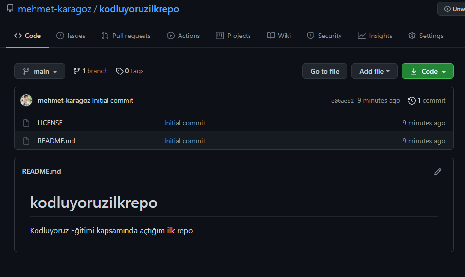

# Kodluyoruz Ilk Repo
---
Bu repo [Kodluyoruz](https://www.kodluyoruz.org) Eğitimi kapsamında açtığım ilk repo. İçerisinde bir adet README dosyası ve bir adet index.html dosyası bulunuyor.



## Installation
---
Öncelikle projeyi clonelayın.

```
git clone https://github.com/mehmet-karagoz/kodluyoruzilkrepo.git
```

## Usage
---
Projeyi cloneladıktan sonra Visual Studio Code programında açınız.

Windows için:

```
cd kodluyoruzilkrepo
code .
```

## Contributing
---
Pull requestler kabul edilir. Büyük değişiklikler için, lütfen önce neyi değiştirmek istediğinizi tartışmak için bir konu açınız.

## License
---
[MIT](https://choosealicense.com/licenses/mit/)